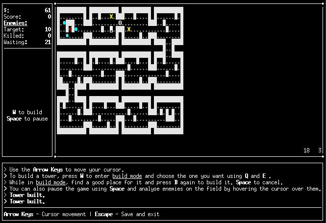

# fiTD 1.0 
*A basic console-based tower defense game engine.*

*Created by **Jan Vorisek** as the final BI-PA2 seminar assigment at **FIT CTU** in 2018.*

Features:
---
- ncurses-powered renderer
- Standard TD game mechanics, multiple types of AI behaviour
- Fully customisable game properties (single plaintext file)
- Tutorial
- Per-map game saving/loading

Building
---
Dependencies:
- ncurses
- Doxygen (documentation)
- catch2 (tests)

**Compile (./build/):**

`
make
`
*or*
`
make compile
`

**Generate documentation (./doc/):**

`
make doc
`

**Compile and generate documentation:**

`
make all
`

**Run game:**

`
make run
`

**Clean all (documentation, binary, object files)**

`
make clean
`
